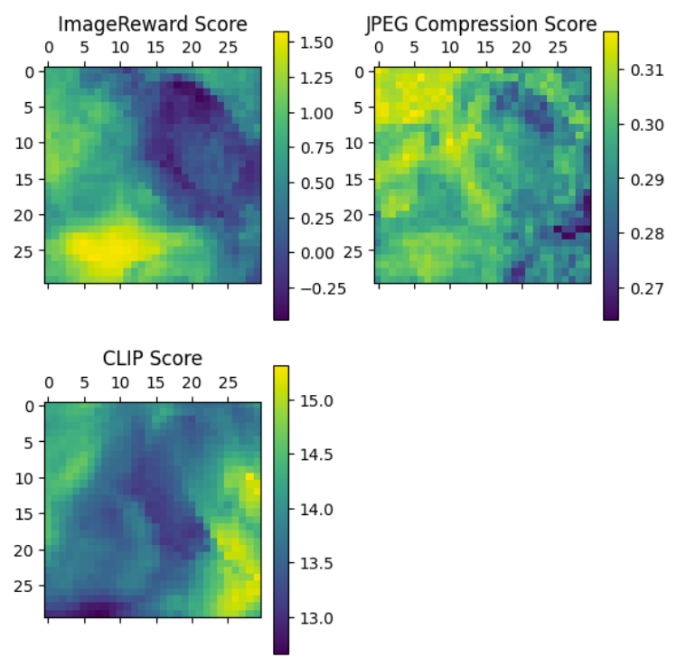

## Noise Search

Inference-time search algorithms to optimize the 'noise' in diffusion-based text-to-image models for arbitrary objective optimization.
Tested algorithms include Stochastic Hill Climbing (SHC), Simulated Annealing (SA), and random sampling.

We show that deliberate sampling algorithms like SHC and SA achieve higher scores than the naive random sampling
commonly used in image generation.

See [./NoiseSearch-paper.pdf](./NoiseSearch-paper.pdf) for more info.

### Concept

Below, we see the optimization landscape of various objective functions (ImageReward, CLIPScore, JPEG compression)
with respect to 2 dimensions in the noise space. We see that the landscapes tend to be locally smooth. This means
that local optimization algorithms like HC and SA should achieve better scores than random sampling.

### Results

Below, is the average score across different objective functions with numbers of sampling steps. We see than SHC and SA
outperform random sampling.

We also see that these inference-time algorithms significantly outperform even larger models.

